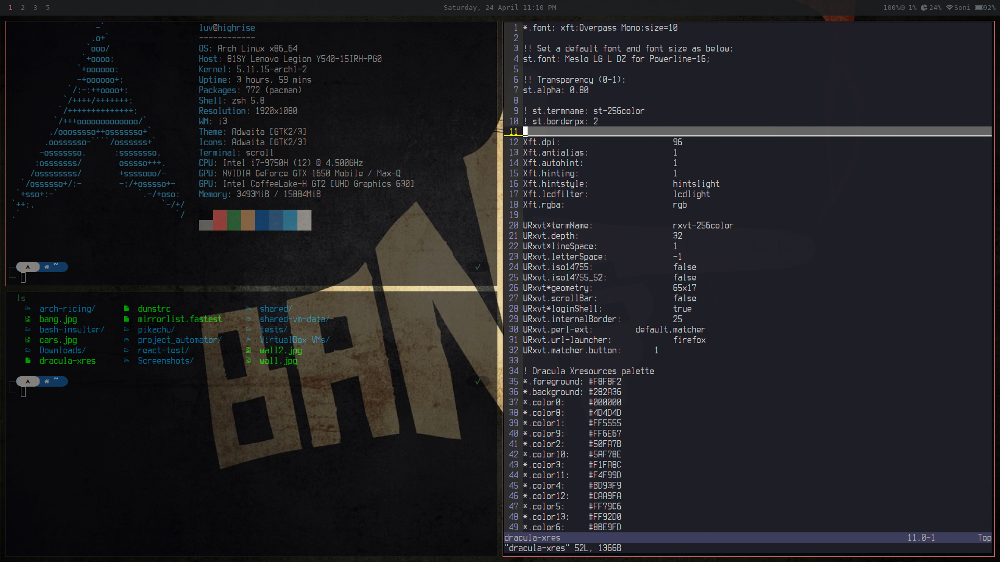

# Project Automator

``This project can do following``

- Install Arch Linux

- Install Tools
  
  - Install I3 Window Manager

  - Install Drivers

    - Graphics, Battery, Audio, Touchpad, Bluetooth

  - Install My Ricing Environment

    - Picom, Oh-My-ZSH, Fonts, Luke's ST Terminal, Flameshot, Dunst, Colorls, Ranger, Rofi, Polybar, Snap and much more

  - Install Development Tools

    - Node, Yarn, Peek, JRE, Google-Chrome, Visual Studio Code, Slack, Postman, Docker, Virtualbox, Mailspring

## Screenshot after installing My Ricing

## Notes

- Make sure you mount the Root partition to /mnt if you're installing Arch Linux or else Automator will exit
- Offline installation feature is unstable for now
- For graphics, it supports Nvidia and Intel for now, feel free to add others and create a PR for this
- Automator might create **post_run.sh** script after exiting the scripts which needs to be executed, Pl reboot your system after executing this script
  